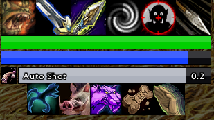
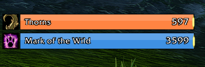
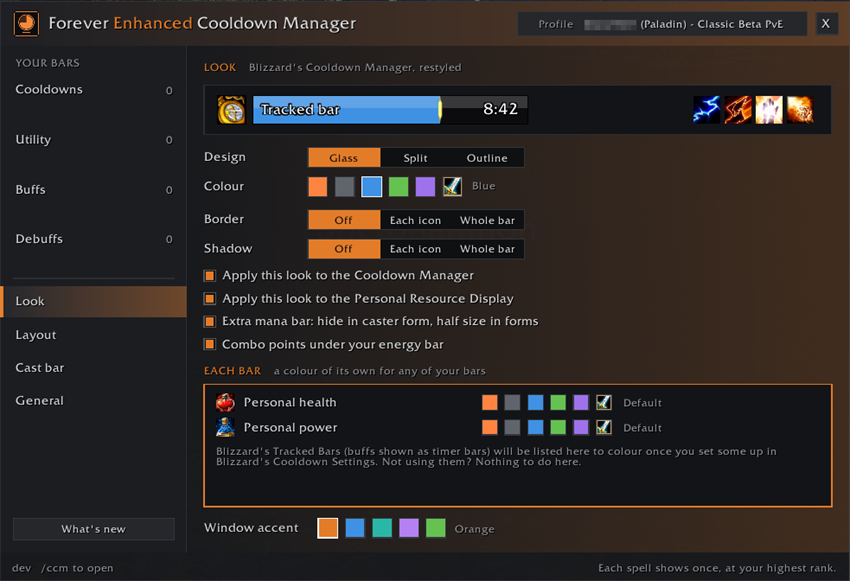
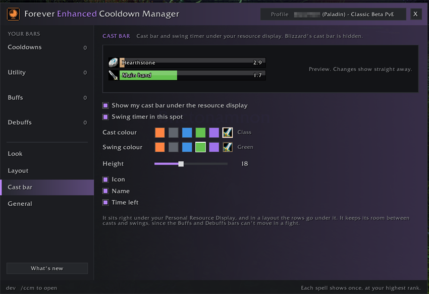
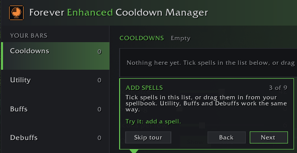
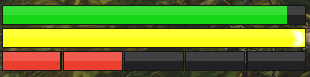
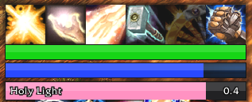

# Forever Enhanced Cooldown Manager

A cleaner look for Blizzard's **Cooldown Manager** and **Personal Resource
Display** on **World of Warcraft: Forever**, plus cooldown, buff and cast bars
of your own that stack around your resource display, and a big pulse on screen
when a cooldown is ready. Works on its own, and sits right at home next to
EraUI.

## Blizzard's Cooldown Manager
- Square icons with big, bold countdown numbers
- Tracked Bars in three designs (Glass, Split and Outline) and six colours, or a
  colour of their own for any bar
- Optional borders and soft shadows, round each icon or round whole rows
- Keybinds on the icons, from your action bars (off by default)
- Visual only: Blizzard still decides what shows and when, and Edit Mode keeps
  positions and sizes

## Personal Resource Display
- Health and power bars in the same designs, in Blizzard's colours or yours
- The extra mana bar some specs get hides in caster form and is half size in
  forms
- Combo points under your energy bar for rogues and druids in cat form, which
  Forever's display leaves out (off by default)
- Your own cast bar right under it, with the spell's icon, name and time left
  (off by default)
- A swing timer in the same spot: your main hand and ranged swings (Auto Shot
  for hunters), in a colour of its own. A cast takes the spot while it lasts
  (off by default)

## Your own bars
- Cooldowns, Utility, Buffs and Debuffs bars: tick spells, or drag them in from
  your spellbook
- Each spell shows once, at your highest rank, and switches when you train a new
  one
- In combat: the cooldown sweep and countdown, grey while cooling down, red out
  of range and blue without enough mana
- Ready glow: the game's proc glow, or a gold edge if you prefer (Look page),
  when a reactive ability like Overpower or Riposte is ready, and whenever the
  game lights a spell up on your action bars
- Cooldowns and Utility bars can show a spell's buff or debuff time, like
  Shadow Word: Pain on your target (off by default)
- Buffs bar: your buffs and class procs with time left and stacks; buffs from
  other players count at any rank. It can also show your debuffs on you, like
  Weakened Soul (off by default)
- Debuffs bar: your own debuffs on your target, with a search that lists your
  class's debuffs. It can show your debuffs on you too (off by default)
- Trinkets, potions, your Hearthstone and ammo, and any spell by name or ID; drag
  items in from your bags, and any ammo becomes one icon for whatever you have
  equipped
- Healthstones, Healing Potions and Mana Potions: one icon each for the best
  one you carry, switching as your bags change
- Keybinds on the icons: the key that casts each spell, at the bottom or a top
  corner, in the size you pick (off by default)
- Per bar: icon size, spacing, icons per row, which way it grows, show, dim or
  hide when ready, spell names, countdown numbers, and show, fade or hide out of
  combat
- Your choice of font and bar texture on the Look page

## Layouts
- One click stacks your bars around your Personal Resource Display: Pyramid,
  Wide, Centre stack, Even, Sides, Twin rows or Funnel
- The display widens to your widest row, and your bars follow it as it moves or
  changes with your form
- Change it row by row: how many icons fit across, which bar goes in which row
  and where the display sits; drag icons between rows, onto each other to swap them, or off to remove them;
  take a whole bar out; Reset or Undo
- All bars: one slider sizes every bar together; Live preview shows your look
  and keybinds on the icons
- Grow arrows show which way each bar grows while you move them

## Cooldown pulse
- A big icon pops up in the middle of your screen when a cooldown you tick is
  ready. Find it under More in the settings (off by default)
- Every spell you know with a cooldown of its own is listed to tick, and new
  ones join as you learn them. Trinkets, potions and items with a use in your
  bags can pulse too
- Each one pulses Quick or Long, each style with its own size, time and sound:
  15 sounds to pick from, played at your Master volume if you like
- How see-through it is, how big it grows, a border and shadow, and where on
  your screen it shows
- If Forever Enhanced Cooldown Pulse is installed too, only one of the two
  pulses runs at a time

## Raid Timers
- Blizzard's pull and battleground start countdown, raid warnings, boss emotes
  and boss cast bars, restyled to match your bars. Find it under More in the
  settings
- Each part stays off until you tick it, with a live preview on the page
- Countdown: a bar colour, and its big numbers in gold, white or the bar's
  colour
- Raid warnings and boss emotes: your choice of font, outline, shadow and
  colours
- Sizes for the countdown bar, its numbers, raid warnings and boss emotes, each
  on its own or all together
- An Edit Mode button beside Boss cast bars opens Edit Mode, where ticking Boss
  Frames shows them
- Visual only: Blizzard still decides what shows and when

## Profiles and settings
- Spell lists and Cooldown pulse ticks live in profiles. Characters can share
  one, even across classes: each only shows its own class's spells and racials.
  Use on all characters puts one profile on every character
- Share a profile as text from the Profile menu, or Import one someone shared:
  it becomes a new profile, so yours stays as it is
- Tank, Healer and Damage keep a profile for each role. Switch with my talents
  (off by default) changes to your main talent tree's role profile
- An accent colour for the window, and What's new after each update, with a
  short tour of just the new features
- Hover anything in the settings and the footer tells you what it does

## Getting around
- The first time you log in, the settings open with a quick tour of the basics.
  Each step opens the right page and points at what it's about
- The ? in the window's title bar walks you through the page you're on, a step
  at a time
- A minimap button: click it for the settings, right-click for What's new, drag
  it round the minimap, set it free-floating to drag it anywhere, or turn it off
  on the General page
- The settings are also under Options > AddOns
- Take the tour again from the General page, and see What's new again from the
  foot of the settings' list
- Found a bug or have an idea? The Discord button on the General page and in
  What's new gives you the invite

If you'd rather type: `/ccm` opens the settings, `/ccm reset` resets your layout
after asking first, `/ccm tour` takes the tour, `/ccm new` shows What's new and
`/ccm discord` gives you the Discord invite.

Blizzard's Cooldown Manager must be on for its new look: Options > Gameplay >
Advanced Options > Enable Cooldown Manager, or the Turn on button in the
settings.

Created by Squirt. Built for World of Warcraft: Forever. All rights reserved.
