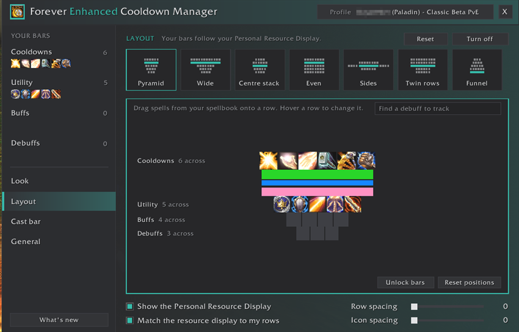
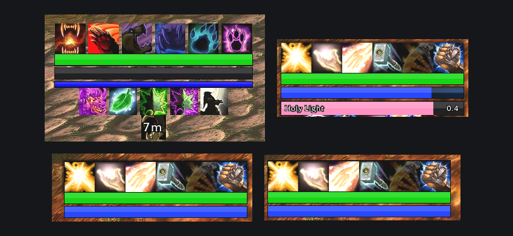
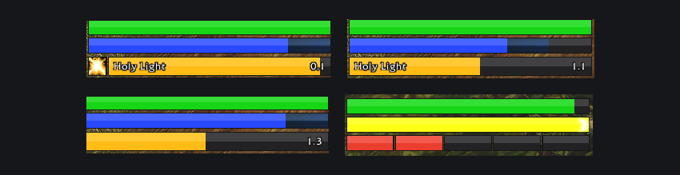

# Forever Enhanced Cooldown Manager

A cleaner look for Blizzard's **Cooldown Manager** and **Personal Resource
Display** on **World of Warcraft: Forever**, plus cooldown, buff and cast bars
of your own that stack around your resource display. Works on its own, and sits
right at home next to EraUI.

## Blizzard's Cooldown Manager
- Square icons with big, bold countdown numbers
- Tracked Bars in three designs (Glass, Split and Outline) and six colours, or a
  colour of their own for any bar
- Optional borders and soft shadows, round each icon or round whole rows
- Visual only: Blizzard still decides what shows and when, and Edit Mode keeps
  positions and sizes

## Personal Resource Display
- Health and power bars in the same designs, in Blizzard's colours or yours
- The extra mana bar some specs get hides in caster form and is half size in
  forms
- Combo points under your energy bar for rogues and druids in cat form, which
  Forever's display leaves out (off by default)
- Your own cast bar right under it, with the spell's icon, name and time left
  (off by default)
- A swing timer in the same spot: your main hand and ranged swings (Auto Shot
  for hunters), in a colour of its own. A cast takes the spot while it lasts
  (off by default)

## Your own bars
- Cooldowns, Utility, Buffs and Debuffs bars: tick spells, or drag them in from
  your spellbook
- Each spell shows once, at your highest rank, and switches when you train a new
  one
- In combat: the cooldown sweep and countdown, grey while cooling down, red out
  of range, blue without enough mana, and a gold edge when a reactive ability
  like Overpower is ready
- Buffs bar: your buffs and class procs with time left and stacks; buffs from
  other players count at any rank
- Debuffs bar: your own debuffs on your target, with a search that lists your
  class's debuffs
- Trinkets, potions, your Hearthstone and ammo, and any spell by name or ID
- Per bar: icon size, spacing, icons per row, which way it grows, hide when
  ready, spell names, countdown numbers, and show, fade or hide out of combat

## Layouts
- One click stacks your bars around your Personal Resource Display: Pyramid,
  Wide, Centre stack, Even, Sides, Twin rows or Funnel
- The display widens to your widest row, and your bars follow it as it moves or
  changes with your form
- Change it row by row: how many icons fit across, which bar goes in which row
  and where the display sits; drag icons between rows or off to remove them;
  take a whole bar out; Reset or Undo

## Profiles and settings
- Spell lists live in profiles. Characters can share one, even across classes:
  each only shows its own class's spells and racials. Use on all characters puts one profile
  on every character
- An accent colour for the window, and What's new after each update

## Getting around
- The first time you log in, the settings open with a quick tour of the basics.
  Each step opens the right page and points at what it's about
- A minimap button: click it for the settings, right-click for What's new, drag
  it round the minimap, or turn it off on the General page
- `/ccm` opens the settings; they're also under Options > AddOns
- `/ccm tour` takes the tour again, and `/ccm new` shows What's new again
- Found a bug or have an idea? The Discord button on the General page and in
  What's new gives you the invite, or type `/ccm discord`

Blizzard's Cooldown Manager must be on for its new look: Options > Gameplay >
Advanced Options > Enable Cooldown Manager, or the Turn on button in `/ccm`.

Created by Squirt. Built for World of Warcraft: Forever. All rights reserved.
